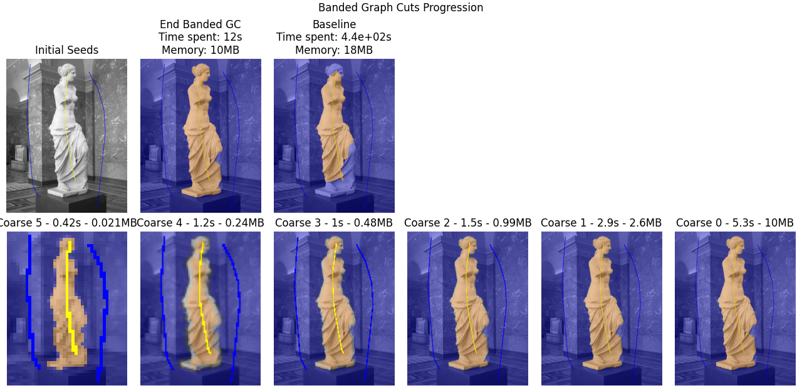
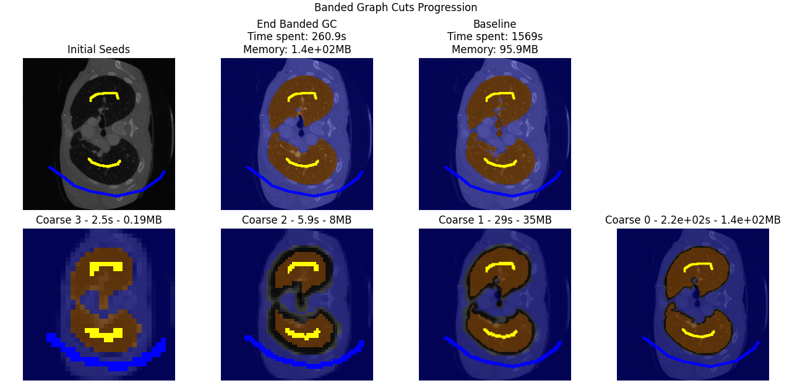

# Banded Graph Cut for Fast Image Segmentation

This repository implements a Banded Graph Cut method to accelerate image segmentation using a hierarchical approach. The method first computes a coarse segmentation at low resolution and then refines it within a narrow band around the detected boundary. This significantly reduces computation time and memory usage compared to traditional graph cut methods.

## Implementation
- **Coarsening:** Downsamples the image to reduce graph complexity.
- **Initial segmentation:** Performs graph cut at the coarse level.
  - We succesfully re-implemented the maxflow algorithm from scratch. But for a fairer evaluation of the method, we use the ``PyMaxFlow`` implementation, which rely on C
- **Refinement:** Constructs a high-resolution graph only in a narrow band for efficiency (using ``scipy.ndimage`` morphological operations to compute the band).
- **3D extension:** Adapts the approach for volumetric medical images.

## Results
### 2D Image Segmentation
<table>
  <tr>
    <th>Image</th>
    <th>Resolution</th>
    <th colspan="2">Time</th>
    <th colspan="2">Memory</th>
    <th colspan="2">Dice Score</th>
  </tr>
  <tr>
    <th></th>
    <th></th>
    <th>Regular</th>
    <th>Banded</th>
    <th>Regular</th>
    <th>Banded</th>
    <th>Regular</th>
    <th>Banded</th>
  </tr>
  <tr>
    <td>Eiffel Tower</td>
    <td>640x1066</td>
    <td>61s</td>
    <td>4s</td>
    <td>6.15MB</td>
    <td>0.033MB</td>
    <td>0.9850</td>
    <td>0.8789</td>
  </tr>
  <tr>
    <td>Venus de Milo</td>
    <td>1257x1600</td>
    <td>4min20s</td>
    <td>3.8s</td>
    <td>18.1MB</td>
    <td>9.1MB</td>
    <td>0.9746</td>
    <td>0.9891</td>
  </tr>
  <tr>
    <td>Cow</td>
    <td>3840x2160</td>
    <td>12min30s</td>
    <td>4.1s</td>
    <td>74.7MB</td>
    <td>5.71MB</td>
    <td>0.9996</td>
    <td>0.9996</td>
  </tr>
</table>




### 3D Medical Image Segmentation

<table>
  <tr>
    <th>Scan</th>
    <th>Resolution</th>
    <th colspan="2">Time</th>
    <th colspan="2">Memory</th>
    <th colspan="2">Dice Score</th>
  </tr>
  <tr>
    <th></th>
    <th></th>
    <th>Regular</th>
    <th>Banded</th>
    <th>Regular</th>
    <th>Banded</th>
    <th>Regular</th>
    <th>Banded</th>
  </tr>
  <tr>
    <td>Heart</td>
    <td>11 M voxels</td>
    <td>32min 38s</td>
    <td>17s</td>
    <td>102MB</td>
    <td>63MB</td>
    <td>0.5545</td>
    <td>0.8223</td>
  </tr>
  <tr>
    <td>Lungs</td>
    <td>11 M voxels</td>
    <td>26min 09s</td>
    <td>2min 20s</td>
    <td>100MB</td>
    <td>150MB</td>
    <td>0.9707</td>
    <td>0.9806</td>
  </tr>
</table>

Below is the graph cut result on the slice which contains seed labels (the other slices don't have seeds). Even if we only show one slice, the graph cut is done in 3D.



## Dependencies
- Python
- OpenCV
- NumPy
- SciPy
- PyMaxFlow

## Usage
Run the segmentation script with:
```bash
python banded_graph_cut_2d.py
```
For 3D segmentation:
```bash
python banded_graph_cut_3d.py
```

## Authors
- Emilien Biré
- Damien Bouet
- Alexandre Dessagne

